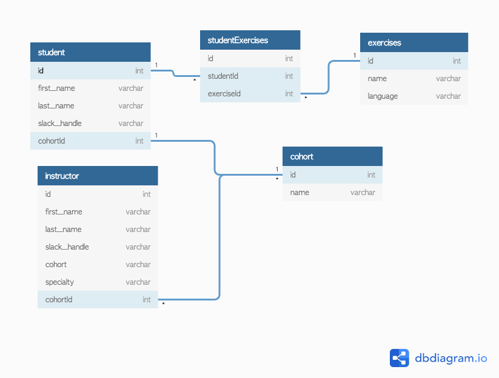

# Tracking-Student-Exercises
A console application that tracks exercises that are assigned to students at Nashville Software School.

## Objective 
The learning objective of this exercise is to practice creating instances of custom types defined with class, establishing the relationships between them, and practicing basic data structures in Python.

## ERD

### Student 
A student can only be in one cohort at a time. A student can be working on many exercises at a time.
1. First Name 
2. Last Name 
3. Slack Handle
4. The Student's Cohort 
5. The collection of exercises that the student is currently working on

### Cohort 
Must define a type for representing a cohort in code. 
1. The cohort's name (Evening Cohort 6, Day Cohort 26, etc.)
2. The collection of students in the cohort. 
3. The collection of instructors in the cohort.

### Instructor 
Must define a type for representing an instructor in code. 
1. First Name 
2. Last Name 
3. Slack Handle
4. The instructor's cohort 
5. The instructor's specialty (e.g. dad jokes, excitement, dancing, etc.) 
6. A method to assign an exercise to a student

### Exercise 
Must define a type for representing an exercise in code. An exercise can be assigned to many students.
1. Name of exercise 
2. Language of exercise (JavaScript, Python, CSharp, etc.)

#### Running the code 
To run the code, execute the following command form your terminal: python main.py